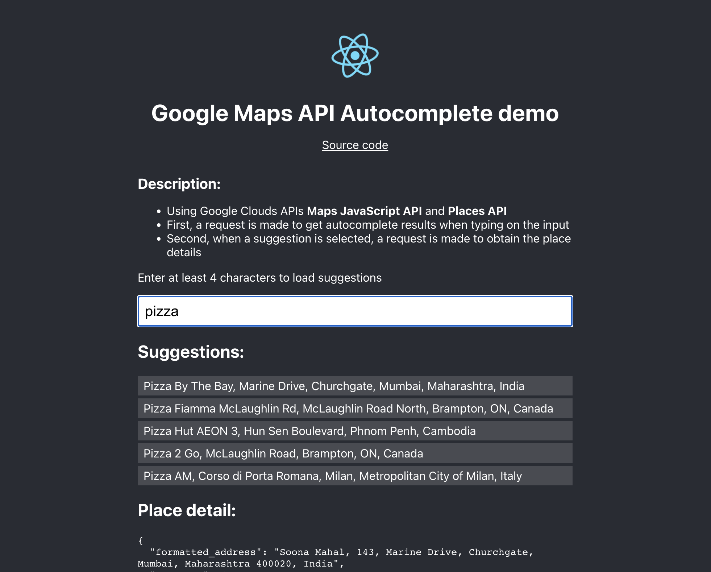

# Google Autocomplete API + React demo

[https://google-autocomplete-api-react-demo.netlify.app](https://google-autocomplete-api-react-demo.netlify.app)

Demo project showing how to set up a React input component with autocomplete functionality using Google APIs.

Suggestions are shown as a plain list in this demo. Normally, you'll want to render them in a suggestions popover below the input.

## Instructions

* Set up a Google Cloud project
* Enable the Maps JavaScript API and the Places API.
* Create an access token to use those APIs, and set it in `.env.local` with name `REACT_APP_GOOGLE_MAPS_API_API_TOKEN`

Run `npm install` and `npm run start` to kick it off locally.

## Attributions

It was made with care starting from [Create React App.](https://github.com/facebook/create-react-app) Create React App [is not dead!](https://github.com/reactjs/reactjs.org/pull/5487#issuecomment-1409720741)
